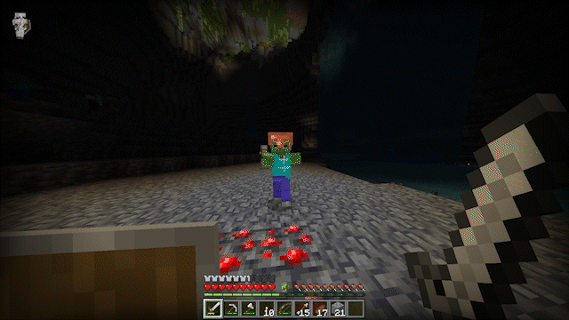
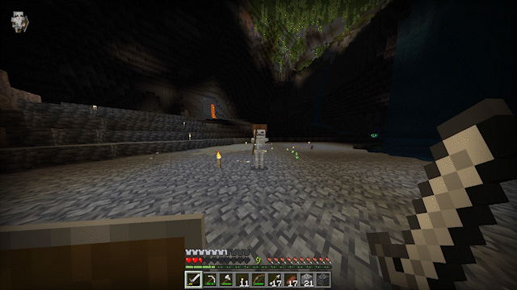
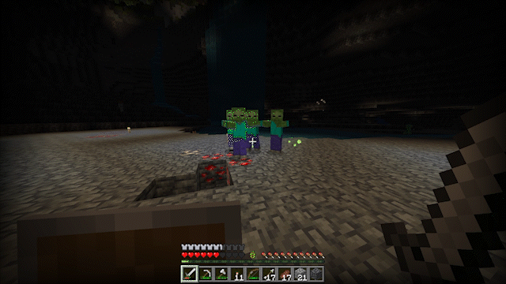

<h3 align="center"> 🟢 Updated for Minecraft Bedrock v1.21.131</h3>

---

| <h3></h3> |
| :-: |
| <b>Swing-based</b> cooldown with <b>crosshair indicator</b>.     |
| <b>Sprint-knockback</b> implementation.     |
| Sword <b>sweeping</b>.   <i>(Sweeping Edge not included.)</i>     |

---

| <h3></h3> |
| :-: |
|<table>  <thead>    <tr>      <th> 🎨 Resource Packs </th>      <th> ⚙️ Supported? </th>    </tr>  </thead>  <tbody>    <tr>      <td style="text-align: center;"> Action-bar based packs. </td>      <td style="text-align: center;"> ❌ </td>    </tr>    <tr>      <td style="text-align: center;"> Everything else. </td>      <td style="text-align: center;"> ✅ </td>    </tr>  </tbody></table>|
|<table>  <thead>    <tr>      <th> 🧠 Behavior Packs </th>      <th> ⚙️ Supported? </th>      <th> 📝 Notes </th>    </tr>  </thead>  <tbody>    <tr>      <td style="text-align: center;"> [Better on Bedrock v1.2.0](https://www.minecraft.net/en-us/marketplace/pdp/poggy/better-on-bedrock-v1.2.0/6c3a6979-dc77-41c6-b19e-0071dabedf71) </td>      <td style="text-align: center;"> ✅ </td>      <td style="text-align: center;"> Custom Damage and Cooldown balancing. </td>    </tr>    <tr>      <td style="text-align: center;"> [CAVE DWELLER Add-On (Official) v1.2](https://www.minecraft.net/en-us/marketplace/pdp/poggy/better-on-bedrock-1.1.3/6c3a6979-dc77-41c6-b19e-0071dabedf71) </td>      <td style="text-align: center;"> ✅ </td>      <td style="text-align: center;"> AI Support. </td>    </tr>    <tr>      <td style="text-align: center;"> Addons with custom tools. </td>      <td style="text-align: center;"> ✅ </td>      <td style="text-align: center;"> Smart generic item tag-type cooldown. </td>    </tr>  </tbody></table>|

  
---

| <h3></h3> |
| :-: |
| After [<b>Core Handler API</b>](https://github.com/karlchastin/core-handler-api) is officially released. |

---

| <h3></h3> |
| :-: |
| 📩 Submit an [issue](https://github.com/karlchastin/chas-java-combat-addon/issues) and label it appropriately! |

---

| <h3></h3> |
| :-: |
|  

  |
|  

  |

---

<h3 align="center"></h3>
